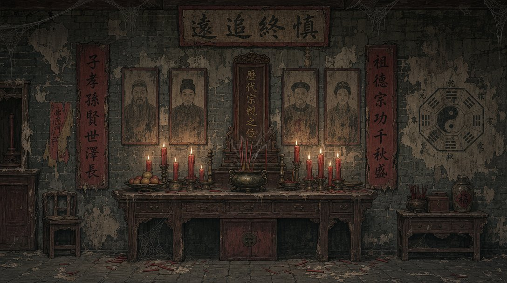

**玄符侦探：我替爷爷守事务所**

**D-10 美术风格指南（v1.2 局部更新）**

*Art Style Guide — v1.2 Incremental Update*

|                |                                                                                                                                                            |
|----------------|------------------------------------------------------------------------------------------------------------------------------------------------------------|
| **文档编号**   | D-10                                                                                                                                                       |
| **文档名称**   | 美术风格指南（Art Style Guide）                                                                                                                            |
| **当前版本**   | v1.2 — 局部更新/新增：新增「出图技术规范」（平台与模型）；回填「基准提示词库」（Phase 3.1 验证版）；新增「生产方法与可交互物编排规范」；新增画风基准样板图 |
| **负责 Agent** | M1 视觉提示词                                                                                                                                              |
| **输入来源**   | D-01 v1.2 / D-05 v1.0 / D-06 v1.1 / D-09.5 v1.1 / Phase 3.1 出图验证                                                                                       |
| **输出给**     | M1 自用 / M2 / M4 / 后续章节全员                                                                                                                           |
| **内部审批**   | P1 总策划 ✓ M1 自查 ✓ → 提交人工审批                                                                                                                       |
| **当前状态**   | \[ IN REVIEW \] — v1.2 新增技术与生产规范；恒定提示词待 Phase 5 与 M1 最终锁定                                                                             |

**一、文档说明与使用规则（不变，重申）**

本文档是全系列最重要的视觉标准文档。v1.2 在 v1.0/v1.1
基础上仅新增/更新以下内容：出图技术规范、基准提示词库回填、生产方法与可交互物编排规范、画风基准样板图。其余章节（全局视觉定位、主色系、构图原则、道具图标规范、NPC
精灵图规范、跨章节复用规则、场景变体图规范）以 v1.0/v1.1
为准，本文档不重复列出。

**核心规则（不变）：**后续章节生成同类素材时，必须以本文档「锁定提示词」为基础，只允许修改「场景描述词」和「内容词」，不得修改「风格词」和「技术参数」。

**二、出图技术规范（v1.2 新增）**

本章定义素材生成所用的平台、模型与工具，属于「技术参数」范畴，未经审批不得擅改。

**2.1 平台与模型**

| **用途**            | **平台 / 模型**                                      | **说明**                                                                                                                                                                                      |
|---------------------|------------------------------------------------------|-----------------------------------------------------------------------------------------------------------------------------------------------------------------------------------------------|
| 场景背景（主力）    | fal.ai · GPT Image 2 (openai/gpt-image-2)            | 质量高、中文渲染准确、跟提示词紧、可商用。同步端点 https://fal.run/openai/gpt-image-2；参数 prompt / image_size=landscape_16_9 / quality（medium 迭代、high 定稿）；计费约 \$0.01–\$0.41/张。 |
| 内容兜底 · 快速草图 | fal.ai · Flux schnell (fal-ai/flux/schnell)          | Apache 2.0 可商用、快且便宜、enable_safety_checker:false 可关安全检查。GPT 因护栏拒绝的极端内容用它兜底。                                                                                     |
| 图像编辑 · 场景变体 | fal.ai · GPT Image 2 /edit (openai/gpt-image-2/edit) | 用于第七章「场景变体图」：在基础图上局部修改（取走道具/开门/NPC 消失），保持光影、色调、透视一致。                                                                                            |
| 不采用              | OpenAI 官方 API / 国内文生图 API                     | 前者国区封锁 + 组织验证 + 另套付款；后者（通义万相等）强制内容审核，恐怖/灵异题材易被拒。                                                                                                     |

**2.2 出图工具**

- 调用：~/xuanfu-shared/genimage.sh "\<prompt\>" "\<文件名.png\>"
  \[gpt\] —— 第三参数 gpt = GPT Image 2；省略 = Flux schnell。

- 密钥从 ~/.fal_key 读取（不入文档/对话明文）。

- 输出存 ~/xuanfu-shared/art/，并自动镜像复制到 Windows 目录
  C:\Users\Administrator\Desktop\xuanfu\Demo\M1\\ 便于查看。

**2.3 中文文字处理（重要）**

- 扩散模型对中文易乱码：Flux 乱码明显，GPT Image 2 基本准确。

- 装饰性背景文字（匾额、对联）可由 GPT
  直接烤入背景图；玩家需精确阅读的文字（线索、UI、提示）一律走引擎文字层，保证清晰、可改、可本地化。

**2.4 风格一致性手段**

- 一致性依靠：本文档「恒定风格句」prompt 模板 + 画风基准样板图 + GPT
  Image 2 /edit 局部编辑。

- GPT Image 2 为闭源模型，不支持自训 LoRA；Demo 阶段不训 LoRA。（LoRA
  仅适用于 Flux 路线，留待全本阶段评估。）

**三、基准提示词库（3.3 回填 · v1.2 · Phase 3.1 验证版）**

提示词结构 = 恒定风格句（锁定，不得改）+
场景内容句（每个场景只替换此段）。

**① 恒定风格句（英文 · Phase 3.1 验证 · 待 Phase 5 与 M1 最终定稿后正式
LOCK）：**

> flat 2D paper-theater illustration, point-and-click escape room game
> background, hand-drawn cutout style like a flat stage backdrop,
> strictly head-on eye-level elevation view with NO perspective and NO
> depth, wall parallel to the camera, \[SCENE CONTENT\], thick dust,
> cobwebs, peeling decayed surfaces, desaturated muted palette of grimy
> grey-green and brown with cinnabar-red accents, dim uneven
> candlelight, deep flat shadows, quiet oppressive eerie Chinese
> folk-horror mood, grungy hand-painted texture, storybook horror, NOT
> photorealistic, NOT 3d render, NO perspective, flat orthographic
> composition

**② 场景内容句（\[SCENE CONTENT\]，按 3.2 各场景填写）——
已验证样例：祭祀陈列室**

> a derelict Chinese ancestral worship hall, a low wooden altar table
> against a grimy cracked grey-brick wall, a bronze incense burner with
> smoking joss sticks, rows of guttering red candles, offering bowls,
> hanging vertical red couplet scrolls and an ancestral tablet, faded
> ancestor portraits, an eight-trigram bagua chart, scattered spent
> incense sticks on the floor

**出图验收三标准：**① 扁平正视、非写实/非电影感/非 3D；② 中式氛围到位；③
破败 / 积尘 / 压抑感足。

**四、生产方法与可交互物编排规范（v1.2 新增 · ⭐ 关键）**

**设定约束：**本作藏于场景中的可交互道具无热点高亮，玩家须凭画面自行发现；且每件道具的位置由
D-07 谜题设计精确规定。

**由此推论：**场景构图必须人工编排，不得交给模型自动生成整张成品场景——纯文生图只能给「画风长相」，给不了「受控构图 +
无高亮可发现性」。

**生产流程（Demo / Phase 5 落定）：**

1.  GPT Image 2 出背景板（固定墙体、陈设、氛围；装饰性中文可烤入）。

2.  可交互道具单独出贴片（GPT 或 Flux），纯色背景便于抠图。

3.  在 Cocos（成品，每个交互物 = 一个 sprite 节点）/
    Photopea（美术合成）中，按 D-07 谜题精确定位人工拼装。

4.  做旧、光影、可读中文层作为叠加图层后期合成。

5.  道具贴片一图两用：既作场景内物件、又作道具栏图标，避免重复出图（呼应横屏纯
    2D「单背景 + 可交互热点」结构）。

**可发现性把关：**可交互物在背景中需做到「看得见但不送分」（轻微高光 /
异常细节 / 位置引导），由 M1 与 P3 在 Phase 5 对照 D-07 逐场景核校。

**精确构图技术手段：**布局约束生成（GPT Image 2 /edit 图生图、Flux
ControlNet）或上述「零件 + 拼装」。

**五、画风基准样板图（v1.2 新增）**

*第一章 · 清代祭祀陈列室（ch1-ritual-gpt-01.png；GPT Image 2 +
第三章恒定风格句生成）*

达标基准：扁平正视、手绘做旧；中文正确（慎終追遠 / 歷代宗親之位 / 对联 /
福 / 八卦）；中式恐怖氛围到位；内容未被审核拒绝。本图为 Phase 3.1
验证基准，正式定稿时以人工审批通过的版本替换。

**内部审批记录**

**P1 总策划 —— 审查**

| **检查项**                 | **上游要求**                           | **实际内容**                                                            | **结论** |
|----------------------------|----------------------------------------|-------------------------------------------------------------------------|----------|
| 出图平台/模型已定          | 需可商用、内容可控、中文可用、付款可行 | 二章定 fal + GPT Image 2 主力 / Flux 兜底；OpenAI 官方与国内 API 已排除 | ✓ 通过   |
| 基准提示词库已回填         | 3.3 待回填锁定提示词                   | 三章给出恒定风格句 + 内容句模板，附祭祀室验证样例                       | ✓ 通过   |
| 生产方法符合「无高亮」设定 | 可交互物无热点高亮、位置由 D-07 定     | 四章定「人工编排 + AI 出零件 + 拼装」，禁止整图自动构图                 | ✓ 通过   |

| **审批人** | **审批意见**                                                                                                     | **结论** |
|------------|------------------------------------------------------------------------------------------------------------------|----------|
| P1 总策划  | D-10 v1.2 新增出图技术与生产规范，与 Phase 3.1 验证一致；恒定提示词待 Phase 5 与 M1 最终锁定。建议提交人工审批。 | ✓ 通过   |

**D-10 美术风格指南 v1.2 \| 内部审批 P1 ✓ M1 ✓ \| 状态：\[ IN REVIEW
\]**
